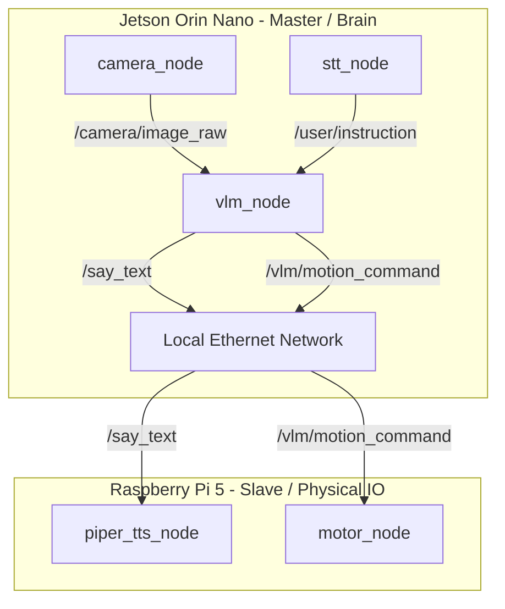

# robot_ILiAD - Distributed Autonomous Talking Robot

[](https://docs.ros.org)
[](https://www.python.org)
[](https://ollama.com)
[](LICENSE)

---


**Autonomous robot boosted with openVLA / Gemma 3**

The goal of this project is to create a robot capable of interacting with a human and realize an action based on the instruction of the user.

---

---

## System Architecture



### 1. Jetson Orin Nano (Master/Brain)
Runs at full power (MAX-N) to host the Gemma 3:4B VLM. It physically hosts the USB Webcam and Microphone, eliminating video streaming network overhead.
*   **`camera_node`** (`robot_camera`): Captures MJPG frames from `/dev/video0` at 640x480, resizes them to 512x512, and publishes to `/camera/image_raw`.
*   **`stt_node`** (`robot_audio`): Continuously captures microphone input, transcribes it locally using Google Speech Recognition, and publishes user commands to `/user/instruction`.
*   **`vlm_node`** (`robot_vlm`): Orchestrates reasoning. When a voice instruction is received, it query Ollama with the latest camera frame, parses the JSON motion/speech instructions, and publishes actions.

### 2. Raspberry Pi 5 (Slave/IO)
Connected via Ethernet (sharing `ROS_DOMAIN_ID=42`), handles low-level hardware interaction and physical output.
*   **`piper_tts_node`** (`robot_audio`): Subscribes to `/say_text`, generates natural French speech using the precompiled Piper binary, and outputs sound to the USB speaker using ALSA (`aplay`).
*   **`motor_node`** (`robot_control`): Subscribes to `/vlm/motion_command`, translates turning angles and distances into wheel ticks/durations, and controls the H-bridge motors via GPIO pins using Board numbering (`rpi-lgpio`).

---

## Package Structure

```
robot_agent_ws/src/
├── robot_bringup/     # Launch files for master and slave configurations
├── robot_camera/      # USB Camera acquisition
├── robot_audio/       # STT (Speech recognition) & TTS (Piper synth + playback)
├── robot_control/     # Kinematics and GPIO motor control
├── robot_vlm/         # Ollama client and reasoning logic
└── robot_ui/          # Web interface
```

---

## Deployment & Running

### Prerequisites

*   **Jetson Orin Nano**: Ubuntu 22.04 + ROS2 Humble, Ollama installed with the `gemma3` model.
*   **Raspberry Pi 5**: Raspberry Pi OS (Debian Trixie) + ROS2 Jazzy (installed via RosPian repository), `python3-rpi-lgpio` installed for GPIO control.

### Setup Environment
On both boards, add the following to `~/.bashrc` to enable automatic ROS2 cross-board discovery:
```bash
export ROS_DOMAIN_ID=42
```

### Running the System

#### 1. On Raspberry Pi 5 (Slave)
Ensure the USB Speaker and motor driver pins are connected.
```bash
cd ~/Education_project/robot_agent_ws
colcon build --symlink-install
source install/setup.bash

ros2 launch robot_bringup pi_slave.launch.py \
  alsa_device:=plughw:2,0 \
  model_path:=/home/kant/piper_models/fr_FR-siwis-medium.onnx \
  piper_path:=/home/kant/piper/piper/piper
```

#### 2. On Jetson Orin Nano (Master)
Ensure the USB Webcam+Mic is connected.
```bash
cd ~/robot_ILiAD/robot_agent_ws
colcon build --symlink-install
source install/setup.bash

ros2 launch robot_bringup jetson_master.launch.py device_index:=0 mic_device_index:=1
```
