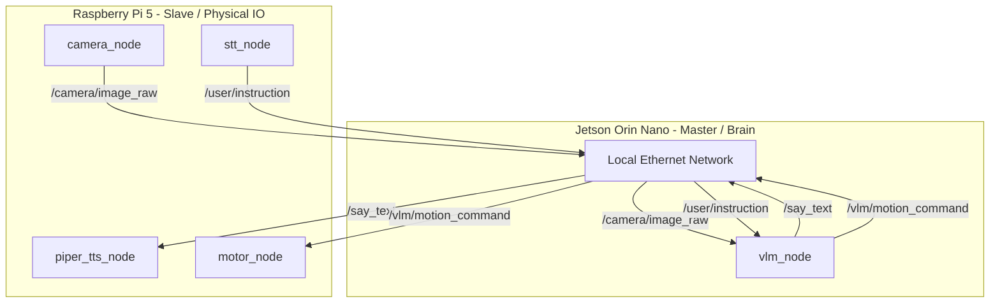

# robot_ILiAD - Distributed Autonomous Talking Robot

[](https://docs.ros.org)
[](https://www.python.org)
[](https://ollama.com)
[](LICENSE)

---


**Autonomous robot boosted with openVLA / Gemma 3**

The goal of this project is to create a robot capable of interacting with a human and performing actions based on user instructions. The system uses a localized Vision-Language Model (VLM) for scene understanding and decision-making, running entirely on edge hardware.

---

## Hardware Optimization

To ensure fast and reliable inference:
1. **Power Supply**: The Raspberry Pi 5 uses the official 27W (5V/5A) power supply to avoid power-related reboots when driving the motors and USB peripherals simultaneously.
2. **NVMe SSD Storage**: The Jetson Orin Nano boots entirely from a 1TB Crucial NVMe SSD. This drastically increases model loading speeds and prevents I/O bottlenecks when the VLM generates text or swaps memory.

## System Architecture

The robot employs a distributed ROS2 architecture. All USB and GPIO hardware peripherals are connected to the Raspberry Pi 5, leaving the Jetson Orin Nano's resources completely dedicated to running the heavy VLM inference.



### 1. Jetson Orin Nano (Master/Brain)
Runs at full power (MAX-N) to host the Gemma 3:4B VLM. It has no physical peripherals connected to it.
*   **`vlm_node`** (`robot_vlm`): Orchestrates reasoning. When a voice instruction is received over the network, it queries the local Ollama API with the latest camera frame. It parses the JSON output to publish speech to `/say_text` and physical actions to `/vlm/motion_command`.

### 2. Raspberry Pi 5 (Slave/IO)
Connected via Ethernet (sharing `ROS_DOMAIN_ID=42`), this board handles all low-level hardware interaction and physical input/output.
*   **`camera_node`** (`robot_camera`): Captures USB Webcam frames.
*   **`stt_node`** (`robot_audio`): Continuously captures microphone input and transcribes it locally using Speech Recognition (English).
*   **`piper_tts_node`** (`robot_audio`): Generates natural English speech using the precompiled Piper binary and outputs sound to the USB speaker.
*   **`motor_node`** (`robot_control`): Translates turning angles and distances into wheel ticks/durations, controlling the H-bridge motors via GPIO pins (`rpi-lgpio`).

---

## Package Structure

```
robot_agent_ws/src/
├── robot_bringup/     # Launch files for master and slave configurations
├── robot_camera/      # USB Camera acquisition
├── robot_audio/       # STT (Speech recognition) & TTS (Piper synth + playback)
├── robot_control/     # Kinematics and GPIO motor control
├── robot_vlm/         # Ollama client and reasoning logic
└── robot_ui/          # Web interface
```

---

## Deployment & Running

### Prerequisites

*   **Jetson Orin Nano**: Ubuntu 22.04 + ROS2 Humble, Ollama installed with the `gemma3` model.
*   **Raspberry Pi 5**: Raspberry Pi OS (Debian Trixie) + ROS2 Jazzy, `python3-rpi-lgpio` installed.
*   **Piper Voice**: Download the English model on the Pi:
    ```bash
    cd /home/kant/piper_models
    wget https://huggingface.co/rhasspy/piper-voices/resolve/main/en/en_US/lessac/medium/en_US-lessac-medium.onnx
    wget https://huggingface.co/rhasspy/piper-voices/resolve/main/en/en_US/lessac/medium/en_US-lessac-medium.onnx.json
    ```

### Setup Environment
On both boards, add the following to `~/.bashrc` to enable automatic ROS2 cross-board discovery:
```bash
export ROS_DOMAIN_ID=42
```

### Running the System

#### 1. On Jetson Orin Nano (Master)
Start the brain first to initialize the VLM.
```bash
cd ~/Education_project/robot_agent_ws
colcon build --packages-select robot_vlm
source install/setup.bash
ros2 launch robot_bringup jetson_master.launch.py
```

#### 2. On Raspberry Pi 5 (Slave)
Ensure the USB Webcam, Mic, Speaker, and motor driver pins are connected.
```bash
cd ~/Education_project/robot_agent_ws
colcon build
source install/setup.bash

ros2 launch robot_bringup pi_slave.launch.py \
  alsa_device:=plughw:2,0 \
  model_path:=/home/kant/piper_models/en_US-lessac-medium.onnx \
  piper_path:=/home/kant/piper/piper/piper
```
